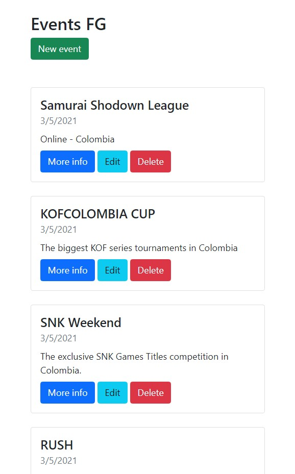
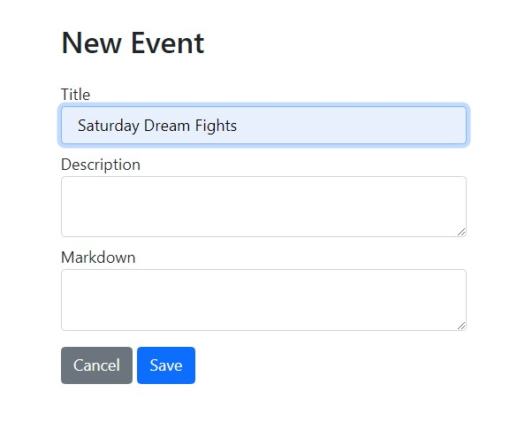
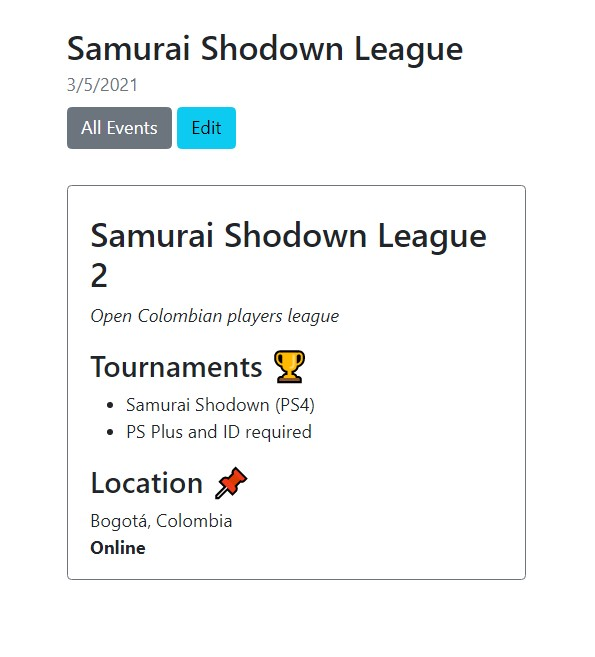

# Markdown - Fighting Games Events
***
_This app allow us view a basic info about Fighting Games events, tournaments and competitons, you could publish your own event, edit and deleted it_

_Add basic info and use the **Markdown** box for add some style info_

_This project is based on **Web Dev Simplified YouTube** Channel project_


## View
***
_There is some views **CRUD** for the diferent app functions._
* Landing Page:<br>


* Create a new event:<br>


* Adding info (markdown box):<br>


* Single event:<br>


* Edit an event: (logged user function)<br>


***

## Technologies
***
A list of technologies used within the project:
* [Node.js](https://nodejs.org/es/) - JavaScript runtime
* [Express](https://expressjs.com/) - Framework for Node.js
* [MongoDB](https://www.mongodb.com/) - Database
* [Mongoose](https://mongoosejs.com/) - Modeling MongoDB
* [EJS](https://github.com/mde/ejs) - Frontend
* [marked](https://marked.js.org/) - markdown features
* [dompurify](https://github.com/cure53/DOMPurify) - Sanitizer for HTML
* [slugify](https://github.com/simov/slugify) - ID to slug
* [method-override](https://github.com/expressjs/method-override#readme) - Lets you use HTTP verbs such as PUT or DELETE in places where the client doesn't support it.
* [jsdom](https://github.com/jsdom/jsdom#readme) - pure-JavaScript implementation
* [dotenv](https://github.com/motdotla/dotenv#readme) - Environment variables 

## Installation
***
If you want clone this project. 
```
$ git clone https://github.com/Dan33311/events-project-nodejs-mongoose-ejs.git
$ cd ../path/to/the/file
$ npm install
$ npm start
```
Side information: Running on Heroku that will allow us to use the application.

https://markdown-fighting-games-events.herokuapp.com/